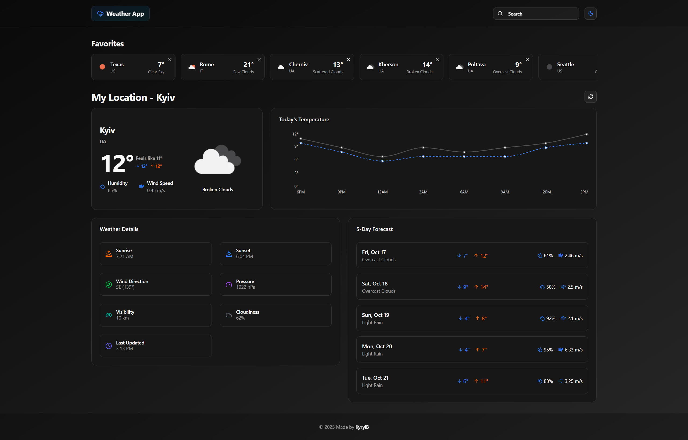
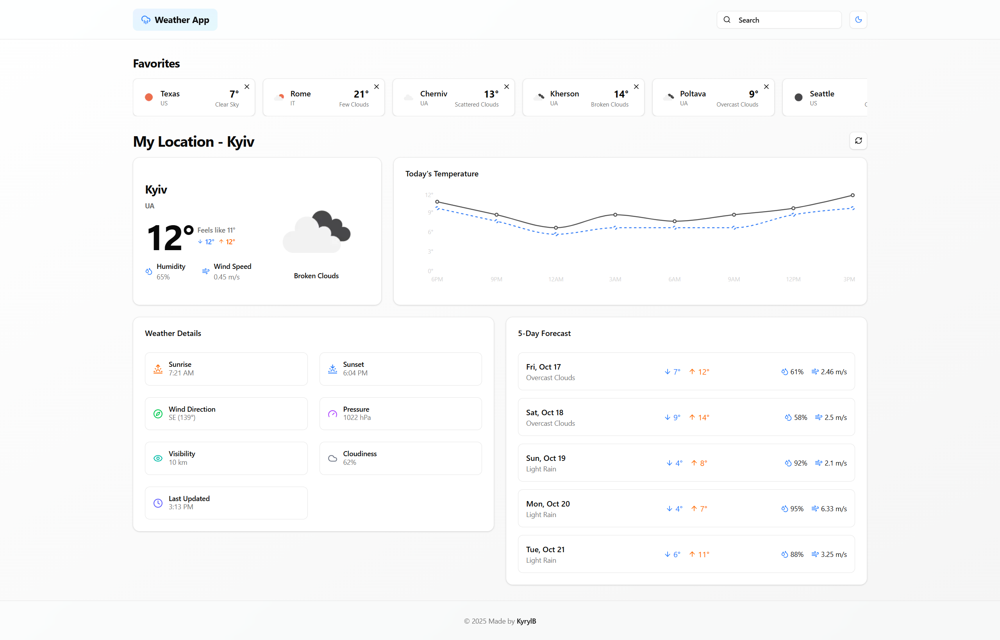
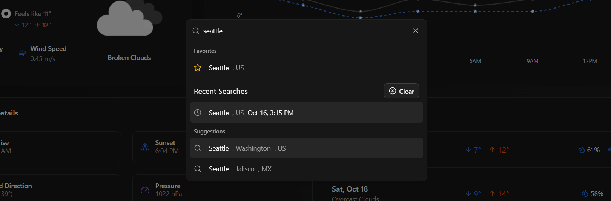

# Weather Test App

A modern, feature-rich weather application built with Next.js 13+ and React, providing real-time weather information with a beautiful and responsive user interface.

## Features

- **Real-time Weather Data**: Get current weather conditions including temperature, humidity, wind speed, and more
- **Location-based Weather**: Automatic weather detection based on user's location
- **City Search**: Search for weather information in any city worldwide
- **Favorites System**: Save and manage your favorite cities for quick access
- **Search History**: Keep track of your recent weather searches
- **5-Day Forecast**: View detailed weather forecasts for the next 5 days
- **Hourly Temperature**: Track temperature changes throughout the day
- **Detailed Weather Information**: Access comprehensive weather data including:
  - Temperature (current, feels like, min/max)
  - Humidity levels
  - Wind speed and direction
  - Sunrise and sunset times
  - Pressure
  - Visibility
  - Cloud coverage
  - Rain volume (when applicable)

## Screenshots

### Dark Theme

_Main dashboard showing current weather, favorites list, hourly temperature graph, and 5-day forecast in dark theme_

### Light Theme

_Same dashboard components shown in light theme, demonstrating the theme toggle functionality_

### Search Functionality

_City search interface showing suggestions, favorites, and recent searches_

The application features a clean, modern interface with:

- Comprehensive weather information display
- Interactive temperature graphs
- Scrollable favorites list
- Theme switching between light and dark modes
- Intuitive city search with suggestions
- Detailed 5-day weather forecast
